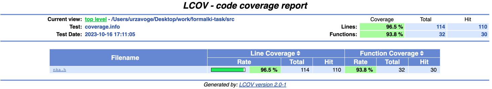

# formalki-task

# to start:
````
make run
make gen-html
make clean
````

# Доказательство корректности алгоритма:

````
    Построение нка:
    Проходимся по регулярке, при char-e добавляем нка с одним
    переходом в стэк, при операциях - извлекаем нужное кол-во
    операндов и делаем с ними операцию. Это работает корректно,
    так как рекурсивное определение регулярки эквивалентно 
    рекурсивному построению нка.
    
    Основной алгоритм:
    Для того, чтобы искать не суффикс, а префикс - развернем
    автомат. Добавим одну фиктивную вершину, из которой будут 
    пустые переходы во все бывшие конечные состояния. Развернем
    все ребра и пометим бывший старт терминальным.
    
    Теперь надо идти из старта дфс-ом и считывать нужный символ.
    Заведем каунтер, показывающий сколько символов осталось
    прочесть. Если каунтер = 0, то завершаемся. Если видим
    ребро по символу - перехрдим и уменьшаем каунтер. Если
    видим пустой переход - то есть три варианта:
    1) Переход в неиспользованную вершину - переходим в нее.
    2) Переход в использованную ввершину, причем на пути из нее
    мы находили нужный символ - завершение алгоритма, так как
    нашли бесконечный цикл => можно считать символ в любой
    степени.
    3) Переход в использованную ввершину, причем на пути из нее
    мы не находили нужный символ - не переходим в нее,
    рассматриваем другие ребра.
    Проверять, находили ли мы нужный символ на пути цикла
    можно, храня для каждой вершины значение каунтера,
    когда мы в нее входим. Значение каунтера надо обнулять,
    каждый раз, когда полностью рассматриваем вершину. Это
    надо делать, чтобы мы находили цикл в поддереве.
    
    Таким образом алгоритм выведет true, только если мы прочитали
    k символов, или нашли бесконечный цикл с ним.

````
# Доказательство полиномиальной асимптотики:


````
    Тут обычный ДФС, но для каждой развилки (которые получаются 
    в результате + в регулярке) мы посетим каждую вершину не
    более k раз. Поэтому асимптотика это дфс * k * (|w|+).
    - O((V + E) * k * |forks|)
    Если k слишком большое, чтобы мы сохраняли
    полиномиальную асимптотику, то либо мы пройдем все ребра
    и вернем false, либо найдем цикл. Поэтому можно считать,
    что O(k) = O(E). Количество развилок оценивается сверху
    длиной регулярного выражения.
    - O((V + E) * E * |reg|)
    Кроме того, O(V) = O(|reg|) и O(E) = O(|reg|),
    так как на каждом символе регулярки при построении
    мы добавляем не больше 2 новых состояний, и не
    более 4 новых переходов.
    - O(|reg|^3)
````


# Скриншот покрытия:
